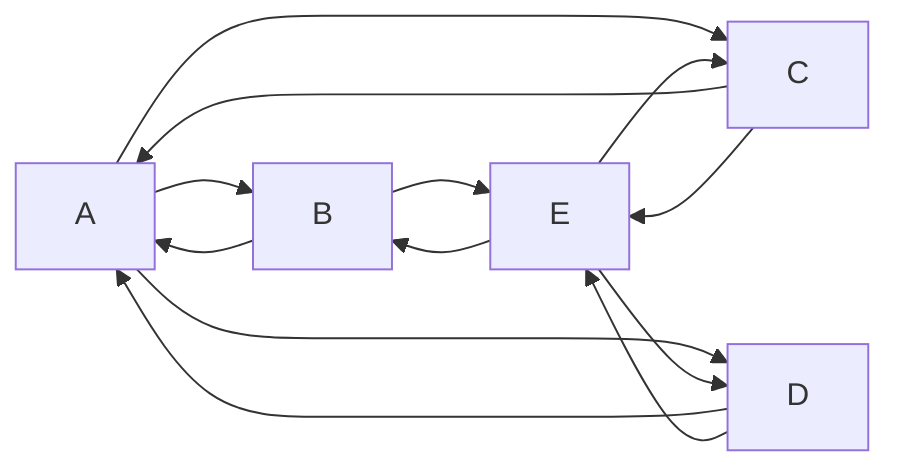

  

# Hi, I'm Olga 👋

### ☁️ Cloud Development & Operations

### 📊 Business Intelligence | 💻 Web & Data Projects

   

   

  

Read More

### Featured Projects

- 🔗 Contact Book (React + Firebase)
- 🔗 Machine Learning Portfolio (Jekyll)
- 🔗 Power BI Dashboards
- 🔗 Cloud-Native Pet Store Deployment

### Skills Snapshot

Python • SQL • Power BI • React • Firebase • Azure • GitHub Pages

### I'm currently working on

🧜‍♀️ [Mastering Mermaid.js: Diagram, Charts and Data Visualization](https://github.com/shap0011/mermaid-learning-notes)

<!--

- 🔭 I’m currently working on the Remote Data and RT Applications demo projects.
- 🌱 I’m currently learning Cloud Development & Operations.
- 👯 I’m looking to collaborate on YouTube videos!
  - [Audio Production Project](https://youtu.be/qpwK6-nTluc?si=6ePrrzzPzjDblj2c)
  - Send me ideas to olga.durham.dev@gmail.com

**shap0011/shap0011** is a ✨ _special_ ✨ repository because its `README.md` (this file) appears on your GitHub profile.

https://mtm6407-static-site-shap0011-netlify.netlify.app/graphics.html

Here are some ideas to get you started:

- 🔭 I’m currently working on ...
- 🌱 I’m currently learning ...
- 👯 I’m looking to collaborate on ...
- 🤔 I’m looking for help with ...
- 💬 Ask me about ...
- 📫 How to reach me: ...
- 😄 Pronouns: ...
- ⚡ Fun fact: ...
  :flag_canada:
  https://www.webfx.com/tools/emoji-cheat-sheet/

https://docs.github.com/en/get-started/writing-on-github/getting-started-with-writing-and-formatting-on-github/basic-writing-and-formatting-syntax

https://github.com/skills/communicate-using-markdown
-->
